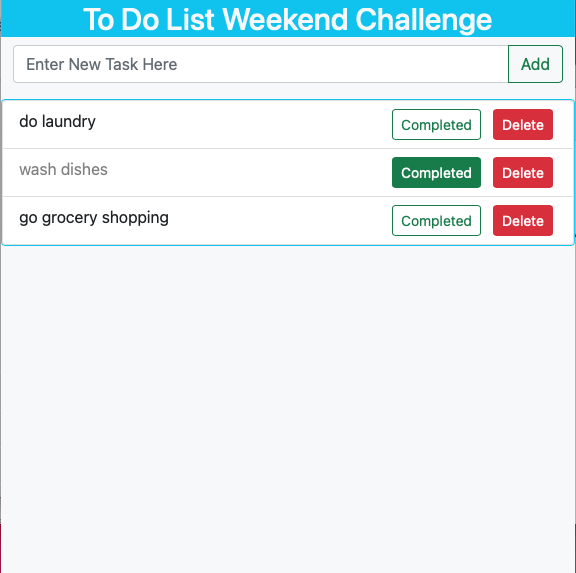

# Project Name
To Do List Weekend Challenge

## Description
I created a to-do list website where users can add tasks to a database, mark them as completed, and delete them from the list. When tasks are marked as completed, their text turn grey and the "Completed" button is shown as a solid green. When the user marks an task as completed or deletes the task, that is reflected in the database.

## Screenshot

## Installation
1. Create a database called `weekend-to-do-list` and run `database.sql`
2. run `npm install`
3. open at localhost:3000 in browser

## Usage
1. Input your task in the text field and click "Add" to add to list.
2. When task is completed, press "Completed" button.
3. When ready to delete task from list, press delete button

## Built With
* HTML
* JavaScript
* JQuery
* AJAX
* Node.js
* Express
* PostgreSQL
* Bootstrap

## Acknowledgement
Thanks to Dev Jana for teaching me the skills to make this app.